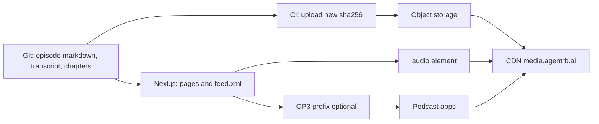

# Podcast hosting on the portal

Research date: 28 September 2026.

## What the portal ships

The show is a video podcast and the hosting budget is zero. The implemented stack is:

- Episode markdown in `content/podcast/`. The show title, description, and subscribe URLs live in [`src/config/content.ts`](../../src/config/content.ts).
- The episode page embeds the YouTube video. Thumbnails come from `i.ytimg.com`.
- Spotify for Creators is the podcast host. Its show URL, the Apple Podcasts URL, and the RSS URL are filled in on `contentConfig.podcast.subscribe` when those accounts exist. Until then those links stay hidden.
- With no episode files, `/podcast` stays the Coming Soon card.

The research below is why the audio and video bytes stay out of git. A generated RSS feed and object storage are not part of this version.


The portal can host a production podcast whose catalog lives in git. Listener audio has to live on object storage behind a CDN. Git, Git LFS, DVC, and git-annex can record that the file exists. None of them is a production origin for podcast apps.

Podcast playback is HTTP progressive download of one audio file. Apple Podcasts requires the enclosure URL to answer `HEAD` and byte-range requests. It is the same mechanism an HTML `<audio>` element uses. HLS and DASH are a different system, used for live or adaptive video, and this show does not need them.

## Verdicts

1. **Catalog in git: yes.** Show notes, transcripts, chapters, and episode metadata belong in the repo, next to the rest of the portal content.
2. **Media in git: no.** Plain blobs, Git LFS, release assets, DVC, and git-annex all fail as the URL listeners and podcast apps download.
3. **Playback: the portal serves pages and RSS. The CDN serves bytes.** Adopt the MIT `feed` package for RSS 2.0. Start with a native `<audio>` island. Add Vidstack only if the episode page needs a custom chapter UI. Put [OP3](https://op3.dev/) in front of the enclosure URL when public download numbers are required. Leave Castopod, Funkwhale, and Podlove Publisher off the runtime.

`podcastRepurpose` in [`src/config/agents.ts`](../../src/config/agents.ts) stays downstream of hosting. Whisper turns a finished episode into a transcript. Hosting does not wait on the agent.

## What exists today

- [`src/config/site.ts`](../../src/config/site.ts) sets `features.podcast` and links nav to `/podcast`. The navbar renders every `siteConfig.nav` item and does not consult the flag.
- [`src/app/(portal)/podcast/page.tsx`](../../src/app/(portal)/podcast/page.tsx) is a Coming Soon page inside the portal layout (navbar and footer).
- [`src/config/content.ts`](../../src/config/content.ts) has hero copy only. There is no show record and no episode collection.
- There is no RSS route, no MDX pipeline, and no audio assets. `package.json` has no feed or player dependency.

## Enterprise bar

An option is production-grade when it meets the first six items.

- Stable public HTTPS enclosure URLs that support `HEAD` and byte-range requests, with long-lived caching.
- RSS 2.0 plus Apple Podcasts tags. Podcasting 2.0 (`xmlns:podcast="https://podcastindex.org/namespace/1.0"`) for transcripts, chapters, and persons when those assets exist.
- CDN delivery, immutable per-file URLs, and backups. Availability does not depend on a git host's raw-file or LFS quotas.
- A small team can run it: deploy, roll back, and keep the portal clone small at tens to low hundreds of episodes.
- A license an enterprise can adopt. AGPL obligations are called out below.
- Measurement compatible with [IAB Tech Lab Podcast Measurement Guidelines 2.2](https://iabtechlab.com/standards/podcast-measurement-guidelines/) (May 2024). A counted download is a unique request that transferred the ID3 header plus about one minute of audio. `HEAD` requests are not downloads. The site player should set `preload="none"` so a page view is not a download.
- Private or SSO-gated audio is a different product. Apple requires the feed to be publicly addressable and rejects password-protected feeds ([Podcast RSS feed requirements](https://podcasters.apple.com/support/823-podcast-requirements)). Signed URLs work for a portal-only player. They do not work for Apple Podcasts or Spotify. This note assumes a public show on `agentrb.ai`.
- Transcripts are linked from the episode page and from the feed (`podcast:transcript`).

## Git as the media store

A 40-minute speech episode encoded at 128 kbps is on the order of 40 MB. Fifty episodes are about 2 GB of current files, and git keeps every previous byte forever. That scale is already past the point where GitHub asks repositories to stay small.

### Plain git blobs: reject

[GitHub large-file limits](https://docs.github.com/en/repositories/working-with-files/managing-large-files/about-large-files-on-github):

- Pushing a file larger than 50 MiB warns.
- GitHub blocks files larger than 100 MiB.
- Recommended repository size is under 1 GB. Under 5 GB is strongly recommended. GitHub Support will ask for a shrink if a repo harms their infrastructure.
- GitHub's own guidance for distributing large binaries is releases, or storage outside git.

[Repository limits](https://docs.github.com/en/repositories/creating-and-managing-repositories/repository-limits):

- Recommended on-disk size (the `.git` directory) is 10 GB. Past that, clones and CI slow down.
- Recommended single object size is 1 MB. The hard cap is 100 MB.
- A single push is capped at 2 GB.

`raw.githubusercontent.com` is a source-view host with per-IP rate limits. It is not a media CDN, it does not give the publisher cache-control over an episode, and a binary committed to history cannot be removed without rewriting that history. Replacing an episode file creates a new blob while the old one remains in every clone.

### Git LFS: reject as the listener origin

Git LFS stores a pointer in the repo and the bytes elsewhere. [GitHub's LFS overview](https://docs.github.com/en/repositories/working-with-files/managing-large-files/about-git-large-file-storage) sets per-file caps of 2 GB (Free and Pro), 4 GB (Team), and 5 GB (Enterprise Cloud). The same page states that Git LFS cannot be used with GitHub Pages.

The [Git LFS Batch API](https://github.com/git-lfs/git-lfs/blob/main/docs/api/batch.md) is how a client actually downloads a file. The client POSTs to `/info/lfs/objects/batch` and receives a short-lived `href`, optional auth headers, and `expires_in` or `expires_at`. Podcast apps request the enclosure URL with a normal `GET`. They do not speak the LFS batch protocol, and they cannot attach a GitHub credential. A raw URL in the repo resolves to the pointer text, not the audio.

[Git LFS billing](https://docs.github.com/en/billing/concepts/product-billing/git-lfs) meters storage and download bandwidth. Included quotas are 10 GiB storage and 10 GiB bandwidth on Free and Pro, and 250 GiB of each on Team and Enterprise Cloud. Bandwidth resets each billing cycle. Without a payment method, LFS is disabled for the rest of the month once the quota is gone. One popular episode, downloaded by podcast apps that fetch the whole file, can exhaust a Free quota. Each re-push of an edited master stores another full copy.

GitLab.com is the same shape. [Project storage](https://docs.gitlab.com/user/storage_usage_quotas/) includes the git repo and LFS: 10 GiB on Free, 500 GiB on Premium and Ultimate, and the project becomes read-only when the quota is exceeded. [LFS rate limits](https://docs.gitlab.com/administration/settings/git_lfs_rate_limits/) on GitLab.com follow the authenticated web limit of 1,000 requests per minute per user. That is a source-control limit, not a listener CDN.

LFS is a reasonable archive for editors who need the master in a clone. The enclosure URL still has to be a separate, stable, public HTTPS address.

### GitHub release assets: reject as the production origin

[About releases](https://docs.github.com/en/repositories/releasing-projects-on-github/about-releases) allows up to 1,000 assets per release, each under 2 GiB, with no documented cap on total release size or bandwidth. Those URLs can carry a file to a browser. They are still a git-host download link: no publisher-controlled cache policy, no bucket versioning, no backup independent of GitHub, and download counts from the Releases API are not IAB 2.2 measurement. Replacing an asset is an operational event on a release, not an immutable object write. Use release assets only as a manual handoff, never as the enclosure URL published to Apple or Spotify.

### DVC and git-annex: reject as the listener path

Both tools keep a pointer in git and put bytes in a remote, usually S3 or compatible storage.

- [DVC remotes](https://doc.dvc.org/user-guide/data-management/remote-storage) support S3, GCS, Azure, SSH, and a read-only HTTP remote. `dvc pull` is a developer command. A public HTTP remote only works when the bucket is already world-readable, which means the durable URL is the object-storage URL. DVC does not remove the need for that store. The portal runtime would gain a Python toolchain it does not use to render pages.
- [git-annex S3 special remotes](https://git-annex.branchable.com/special_remotes/S3/) can set `publicurl` so clones download without AWS credentials, and `git annex whereis` can print that URL. Listeners still fetch S3. The annex branch, unlocked files, and assistant are extra machinery for a catalog that is a handful of markdown files. git-annex is distributed under the GNU AGPL.

Use either tool only if the team already versions large masters for another reason. The enclosure contract below does not go through them.

### Hybrid that keeps git as the system of record: accept

The repo stores the episode record and a content hash. A CI job uploads the audio to object storage when that hash is not already there. The published URL is the CDN URL. The portal clone stays small because the bytes never enter git history.

```text
content/podcast/001-example.md    title, guid, notes, chapters, transcript path
                                  audio.key, audio.bytes, audio.sha256, audio.type
CI upload                         put object if sha256 is new
CDN URL                           written once into the episode record, then frozen
```

Editing the audio after publish writes a new object key. The enclosure URL stays constant for as long as the bytes stay constant, and the GUID stays constant for the life of the episode. Apple requires that GUID, requires each enclosure URL to be unique, and ignores a second item that reuses an enclosure URL ([Apple's enclosure rules](https://podcasters.apple.com/support/823-podcast-requirements)).

## Fit with this portal

Checked against the Next.js 16 docs shipped in `node_modules/next/dist/docs/` (App Router route handlers and route groups).

### Routes

The `(portal)` segment is a route group. It does not appear in the URL, and it is what wraps pages with the navbar and footer ([`src/app/(portal)/layout.tsx`](../../src/app/(portal)/layout.tsx)). Episode pages stay in that group so they share the chrome.

Next.js forbids a `route.ts` in the same folder as a `page.tsx`. The feed is a nested segment:

| URL | File | Runtime |
| --- | --- | --- |
| `/podcast` | `src/app/(portal)/podcast/page.tsx` | Server Component |
| `/podcast/[slug]` | `src/app/(portal)/podcast/[slug]/page.tsx` | Server Component |
| `/podcast/feed.xml` | `src/app/(portal)/podcast/feed.xml/route.ts` | Route Handler `GET` |

The route handler returns `text/xml` (or `application/rss+xml`) built with [`feed`](https://www.npmjs.com/package/feed) (MIT, currently 6.x). `feed` emits RSS 2.0, an enclosure (`url`, `type`, `length`), and iTunes tags when `podcast: true` is set. Podcasting 2.0 tags (`podcast:transcript`, `podcast:chapters`, `podcast:person`) go through its `extensions` list. The handler reads episode files at build time. It does not proxy audio.

When `siteConfig.features.podcast` is false, the pages call `notFound()` and the navbar omits the Podcast item. Today the flag and the nav entry can drift apart; the implementation should derive the nav entry from the flag.

Show-level fields move to [`src/config/content.ts`](../../src/config/content.ts) (and [`src/types/config.ts`](../../src/types/config.ts)): title, description, author, language, categories, explicit flag, artwork URL, and the public feed URL. Those are rebrand fields. Per-episode files stay out of that module so adding an episode is a content commit, not a config edit.

### Episode file

One markdown file per episode under `content/podcast/`. Front matter holds the machine fields. The body is the show notes, rendered on the server. Audio is a URL and a hash, never an import, so the file cannot enter the client bundle.

```yaml
title: Example episode
slug: example-episode
guid: 3f1c2a0e-7b14-4b2a-9c1d-6e5a8b0d4f21
date: 2026-09-28T12:00:00-04:00
summary: One sentence for the feed.
audio:
  key: episodes/001-example.mp3
  url: https://media.agentrb.ai/episodes/001-example.mp3
  bytes: 40123456
  type: audio/mpeg
  sha256: <hex>
duration: 2400
chapters: content/podcast/chapters/example-episode.json
transcript: content/podcast/transcripts/example-episode.vtt
```

`guid` is opaque and never changes, including across CMS migrations. Apple requires it. Filenames and URLs stay ASCII (`a-z`, `A-Z`, `0-9`, and simple separators). Apple rejects other characters in enclosure URLs.

MDX is optional later, for rich notes. The first slice can be markdown plus front matter. The blog is still a placeholder, so this should not introduce a content framework ahead of a real episode.

### Player island

The page stays a Server Component. The only client component is the player, because it needs a DOM media element. It receives the CDN URL, MIME type, and chapters as props.

- **Native `<audio controls preload="none">` is the production default.** Seeking is the browser's range request against the CDN. There is no player dependency, and `preload="none"` matches the IAB guidance against counting a page view as a download.
- **[Vidstack](https://vidstack.io/docs/player/api/providers/audio/) (`vidstack` / `@vidstack/react`, MIT)** wraps the same HTML audio element and adds an accessible, themeable layout. Use it when the episode page needs chapters, playback rate, or a transcript that follows the playhead. It is a client island, loaded only on episode pages.
- **[Podlove Web Player](https://www.npmjs.com/package/@podlove/web-player) (MIT)** is the podcast-specific player (chapters, transcripts). The standalone GitHub repo `podlove/podlove-web-player` is archived; the maintained package lives in the Podlove UI monorepo. The published npm tarball is about 12 MB unpacked, with a CSS bundle on the order of a megabyte, and the embed model is built for WordPress. It fights this portal's Tailwind UI. Skip it.

### Do not proxy the file through Next.js

[Vercel Functions](https://vercel.com/docs/functions/limitations) cap a buffered request or response body at 4.5 MB. A single episode is many times that. Streaming the body through a function also bills duration for every listener-minute and puts the app region on the media path. The enclosure URL and the `<audio src>` point at the CDN. The route handler's only job is XML small enough to fit in a normal response.

Files in `public/` deploy with the app and can play in development. They ride the same deployment as code, grow the upload, and are the wrong backup boundary once more than a few episodes exist. Production audio does not go in `public/`.

## Open-source shortlist

| Option | License | Role | Verdict |
| --- | --- | --- | --- |
| S3, R2, or GCS, plus CloudFront or Cloudflare | Provider terms | Origin and CDN | Adopt |
| `feed` | MIT | RSS in the portal | Adopt |
| Native `<audio>` | n/a | Player island | Adopt |
| Vidstack | MIT | Custom player, later | Adopt only when chapters UI is required |
| OP3 | MIT ([source](https://github.com/skymethod/op3/blob/master/LICENSE)) | Public download measurement | Adopt for a public show |
| Castopod | AGPL-3.0 | Full podcast host | Decline for this portal |
| Funkwhale | AGPL-3.0 | Federated audio server | Decline |
| Podlove Publisher | MIT | WordPress podcast CMS | Decline |
| Podlove Web Player | MIT | Embeddable player | Decline |
| DVC | Apache-2.0 | Large-file pointers | Decline as the listener path |
| git-annex | AGPL | Large-file pointers | Decline as the listener path |
| Whisper, already named in `podcastRepurpose` | Model license varies | Transcripts | Keep downstream of hosting |

### Object storage and CDN

This is the production origin commercial hosts use, without their CMS. [Amazon S3 supports Range GET](https://docs.aws.amazon.com/AmazonCloudFront/latest/DeveloperGuide/RangeGETs.html), and CloudFront forwards range requests to an origin that supports them. [Cloudflare R2's S3 API supports `Range` on `GetObject`](https://developers.cloudflare.com/r2/api/s3/api/). Cloudflare's cache can answer client range requests from cached objects. Any of S3 plus CloudFront, or R2 plus Cloudflare, meets the Apple `HEAD` and byte-range bar. R2 avoids per-request egress fees, which matters once apps download whole episodes. Pick whichever account the team already operates. Put a hostname the portal owns in front of the bucket (`media.agentrb.ai` or similar) so the enclosure URL is not tied to a vendor host.

Object keys are immutable: `episodes/<guid>.mp3` or `episodes/<sha256>.mp3`. `Cache-Control: public, max-age=31536000, immutable`. Backups are bucket versioning plus a lifecycle copy to a second region or account. The portal deploy can roll back without touching audio, and an audio rollback is a bucket restore without a git revert of a 40 MB blob.

### Castopod

[Castopod](https://castopod.org/) is a self-hosted podcast host (PHP, MySQL or MariaDB, Docker or a LAMP install), licensed AGPL-3.0. It generates RSS, implements Podcasting 2.0 (chapters, transcripts, persons, location, funding), imports and exports feeds, and ships analytics aligned with IAB v2. It is also an ActivityPub server. That is a real product, and it meets the podcast-host bar on its own.

It does not plug into this Next.js app. Running it means a second service, a database, PHP upgrades, and a second site, or an iframe of someone else's player. AGPL-3.0 requires that anyone who modifies Castopod and offers it over a network release the corresponding source. Using an unmodified upstream image is a normal self-host. Forking it into the portal, or embedding it so the combined product is a modified network service, pulls that obligation onto the portal. The git-catalog design covers RSS, the player, and transcripts with a smaller operational surface. Castopod is the alternative only if the team wants a multi-show CMS, fediverse comments, and built-in IAB analytics instead of publishing from this repo.

### Funkwhale

[Funkwhale](https://funkwhale.audio/) is AGPL-3.0, Python, and PostgreSQL. Channels can publish an RSS feed, and the same server can subscribe to other feeds. Castopod's own comparison is the useful one: Funkwhale grew podcasts onto a music server, and Podcasting 2.0 tags are not its focus. It is a second platform with federation, a media library, and an admin UI this portal would not use. Decline.

### Podlove Publisher

[Podlove Publisher](https://github.com/podlove/podlove-publisher) is MIT and is the strongest open-source podcast CMS in the WordPress world (RSS, player, contributors, analytics). The current readme targets WordPress and PHP 8. It cannot run inside this repo. Adopting it means operating WordPress beside the portal. Decline.

### OP3

[OP3](https://op3.dev/) is an open prefix. The feed's enclosure URL becomes `https://op3.dev/e/` plus the real CDN URL. OP3 redirects the client to the audio and logs the request on Cloudflare's edge. The project publishes its source (MIT), its bills, and a public stats page per show. It has operated since 2022. The portal does not store or forward the audio.

Use it for a public show that wants IAB-style download numbers without running a log pipeline. Two consequences: the numbers are public, and the first hop of every download is OP3. A private or enterprise-only show should skip OP3 and count downloads from CDN logs under the publisher's own retention rules.

### Whisper

`agentConfig.podcastRepurpose.transcriptionProvider` is already `"whisper"`. The output of that job is a VTT or JSON transcript committed under `content/podcast/transcripts/`. The feed then points `podcast:transcript` at the portal URL for that file. Delivery of the episode does not depend on transcription finishing.

### Adjacent projects, out of scope

- **Icecast** serves live HTTP streams (a radio mount point). It is not an episode archive.
- **AzuraCast** (AGPL) is a station manager on top of Icecast and Liquidsoap. Same live-radio job.
- **Owncast** (MIT) is live video.
- **PeerTube** (AGPL) is a video host with ActivityPub. A video podcast would be a different decision.
- **Transistor, Captivate, Buzzsprout, and Simplecast** are the commercial baseline: stable enclosures, Apple-clean RSS, a CDN, and prefix analytics. They are the checklist to match. They are not components to install. The design in this note matches that checklist inside the portal. Pay one of them only if the team wants their dashboard more than it wants the catalog in git.

## Enclosure URL contract

Every published episode has one URL that:

- is `https` on a hostname the portal controls
- answers `HEAD` and `GET` with `Accept-Ranges: bytes`, `Content-Length`, and `Content-Type: audio/mpeg` (or `audio/mp4` for AAC)
- returns `206` for a `Range` request
- uses an ASCII path
- is written into the episode file once and left unchanged while the bytes are unchanged
- is immutable at the CDN (`Cache-Control` as above)
- is prefixed with OP3 in the feed only, when public measurement is on; the player on the site uses the bare CDN URL so a page view is not forced through the prefix

The RSS item carries `<enclosure url length type>`, a stable `<guid>`, an RFC 2822 `<pubDate>`, and `itunes:duration`. Apple's required channel tags (title, description, language, category, artwork, explicit) come from `contentConfig`.

## Recommended shape



Smallest set to adopt:

- `feed` for the RSS route
- object storage plus a CDN the team already has
- native `<audio preload="none">` on the episode page
- OP3, if public download numbers are in scope for the first launch

Leave Castopod, Funkwhale, Podlove, DVC, git-annex, and Git LFS out of the listener path.

## Follow-on implementation

None of this is built yet. Suggested order, each slice shippable on its own:

1. **Content schema.** Extend `ContentConfig` with the show record. Add `content/podcast/` and a typed loader. Gate `/podcast` and the nav item on `features.podcast`.
2. **RSS.** `feed.xml` route handler, validated against Apple's technical requirements before any directory submission.
3. **Pages and player.** Index and episode Server Components, native audio island, show notes from markdown.
4. **Upload path.** CI uploads on a new `audio.sha256`, refuses to rewrite an existing object key, and fails the build if `bytes` or `sha256` do not match the object.
5. **Transcripts.** `podcastRepurpose` writes VTT into the repo. The feed gains `podcast:transcript`.
6. **Analytics.** Add the OP3 prefix to feed enclosures, or ship CDN logs into an IAB-style counter. The site player stays on `preload="none"`.

## Assumptions

- One public show, subscribable from podcast apps, at modest volume (tens to low hundreds of episodes). The object-storage design still holds as the archive grows; the git catalog stays small either way.
- The portal on `agentrb.ai` remains the website. A second app is justified only if the team later wants Castopod's CMS, fediverse, and built-in IAB analytics more than git-based publishing.
- Private SSO playback was scored and set aside. It would drop OP3, Apple, and Spotify, and replace the public object URL with a short-lived signed URL. The catalog in git would stay.
